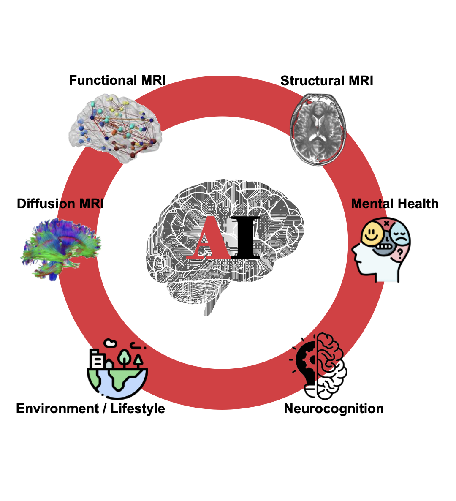

<!-- Full-width title and intro -->
### Machine Intelligence in NeuroImaging (MINI)

The MINI Lab at Weill Cornell Medical College leverages artificial intelligence to accelerate neuroimaging research. We focus on developing novel machine learning methods to analyze longitudinal and multi-modal neuroimaging, neuropsychological, and clinical data, aiming to uncover brain–behavior relationships and identify biomedical phenotypes of neurological and psychiatric conditions.

<!-- Dashed line separator -->

<!-- Two-column layout for image + research interests -->

  

    
  

  

### Research Interests

We are interested in:

1. **Designing cutting-edge AI/ML techniques**, such as self-supervised learning, foundation models, graph-based models, and unbiased learning, for neuroimaging-based analysis.  
2. **Characterizing normative brain development** from childhood through emerging adulthood, as well as aging trajectories, using longitudinal, data-driven, multi-modal approaches.  
3. **Investigating disease-related alterations in neurodevelopment and aging**, and identifying neuromarkers for risk assessment, diagnosis, and targeted interventions.

  

